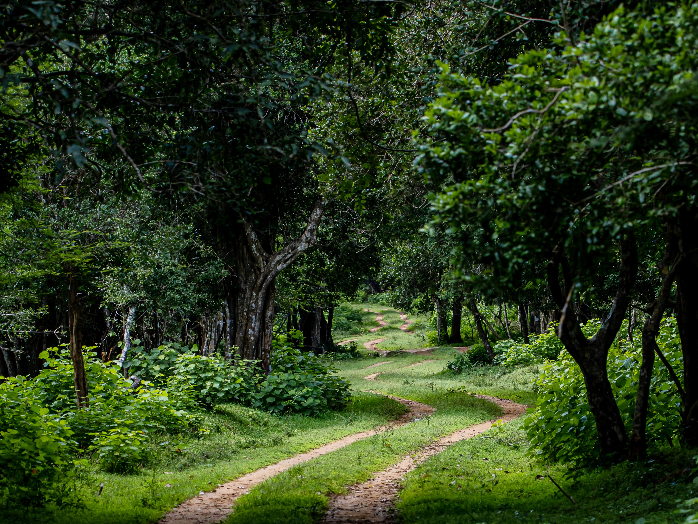

# 🦁 DSP Safari - Luxury Wildlife Resort Website

A stunning, modern website for DSP Hotel & Safari Resort located in the Wilpattuwa area, Sri Lanka. This single-page application showcases luxury lodges nestled in wildlife-rich private reserves, offering visitors an immersive experience where luxury meets wilderness.



## 🌟 Features

- **Responsive Design**: Fully responsive layout that works seamlessly across all devices
- **Modern UI Components**: Built with HeroUI (NextUI fork) for elegant, accessible components
- **Smooth Animations**: Powered by Framer Motion for fluid page transitions and interactions
- **Optimized Performance**: Lightning-fast load times with Vite build tool
- **TypeScript**: Type-safe code for better development experience and fewer bugs
- **Tailwind CSS**: Utility-first CSS framework for rapid UI development

## 🏗️ Project Structure

```
Safari/
├── src/
│   ├── components/
│   │   ├── Header.tsx              # Navigation bar with sticky positioning
│   │   ├── LandingBanner.tsx       # Hero section with dramatic imagery
│   │   ├── IntroSection.tsx        # Introduction to DSP resort
│   │   ├── SectionThree.tsx        # Luxury meets wilderness section
│   │   ├── SectionFour.tsx         # Memorable experience section
│   │   └── SectionFive.tsx         # Wild encounters section
│   ├── App.tsx                     # Main application component
│   ├── main.tsx                    # Application entry point
│   └── index.css                   # Global styles
├── public/                         # Static assets (images, icons)
└── package.json                    # Project dependencies
```

## 🚀 Getting Started

### Prerequisites

- Node.js (v16 or higher)
- npm or yarn package manager

### Installation

1. **Clone the repository**
   ```bash
   git clone <repository-url>
   cd Safari
   ```

2. **Install dependencies**
   ```bash
   npm install
   ```

3. **Start the development server**
   ```bash
   npm run dev
   ```

4. **Open your browser**
   Navigate to `http://localhost:5173` (or the port shown in terminal)

## 📦 Available Scripts

- `npm run dev` - Start development server with hot module replacement
- `npm run build` - Build production-ready application
- `npm run preview` - Preview production build locally
- `npm run lint` - Run ESLint to check code quality

## 🛠️ Technology Stack

### Core Technologies
- **React 19** - Latest version of React for building user interfaces
- **TypeScript 5.7** - Static type checking for JavaScript
- **Vite 6.2** - Next-generation frontend build tool

### UI & Styling
- **Tailwind CSS 4.1** - Utility-first CSS framework
- **HeroUI (NextUI)** - Beautiful, accessible React components
- **Framer Motion 12** - Production-ready animation library

### Development Tools
- **ESLint 9** - JavaScript/TypeScript linting
- **TypeScript ESLint** - TypeScript-specific linting rules

## 🎨 Key Sections

1. **Navigation Header** - Sticky navigation with blur effect featuring:
   - Home icon
   - Experience and Explore links
   - "Start Safari" and "Enquire Now" call-to-action buttons

2. **Landing Banner** - Eye-catching hero section with:
   - Dramatic safari landscape imagery
   - "Escape to our world" tagline
   - Decorative claw mark overlay

3. **Intro Section** - Introduces DSP as a:
   - Wildlife-rich private reserve in Wilpattuwa
   - 4 luxury lodges with unique character and style
   - Illustrated with custom tree and monkey vectors

4. **Experience Section** - "Where Luxury Meets Wilderness"
   - Highlights the Udawalawa location
   - Emphasizes eco-lodge comfort
   - Features interactive "See more" button

5. **Memorable Safari** - Showcases what makes the experience unique

6. **Wild Encounters** - Details guided safari experiences:
   - Elephant sightings
   - Jungle exploration
   - Natural habitat immersion

## 🎯 Design Philosophy

The website embodies the perfect balance between:
- **Natural aesthetics** - Earthy tones and wildlife imagery
- **Modern luxury** - Clean lines and sophisticated typography
- **User experience** - Intuitive navigation and smooth interactions
- **Performance** - Fast loading times and responsive design

## 🔧 Configuration Files

- `vite.config.ts` - Vite configuration with React and Tailwind plugins
- `tsconfig.json` - TypeScript compiler options
- `tailwind.config.js` - Tailwind CSS customization with HeroUI theme
- `eslint.config.js` - ESLint rules and configuration

## 🌐 Browser Support

- Chrome (latest)
- Firefox (latest)
- Safari (latest)
- Edge (latest)

## 📝 Development Notes

### Custom Styling
- Component-specific styles are in `ComponentStyles.css`
- Global styles and Tailwind directives in `index.css`
- CSS modules available for `Input.Design.module.css`

### Image Assets
All images are stored in the `/public` directory including:
- Landing page backgrounds
- Wildlife vectors (monkey, tree)
- Bird and eagle imagery
- Safari landscape photos

## 🤝 Contributing

1. Fork the repository
2. Create a feature branch (`git checkout -b feature/AmazingFeature`)
3. Commit your changes (`git commit -m 'Add some AmazingFeature'`)
4. Push to the branch (`git push origin feature/AmazingFeature`)
5. Open a Pull Request

## 📄 License

This project is private and proprietary.

## 👥 Contact

**DSP Hotel**
- Website: [Link to be added]
- Email: [Contact email]
- Location: Wilpattuwa area, Sri Lanka

---

Built with ❤️ for wildlife enthusiasts and luxury travelers

